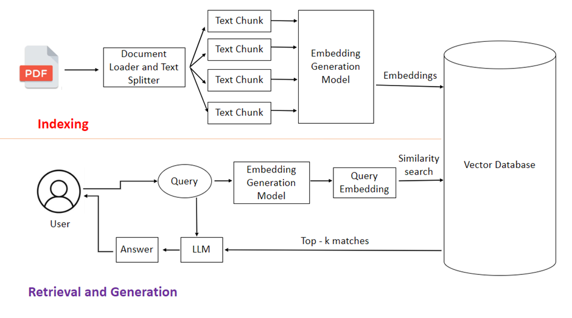

# RAG AI Agent

A full-stack application that enables users to upload PDF documents and interact with them through a chat interface using Retrieval-Augmented Generation (RAG) technology.



## Table of Contents
- [Overview](#overview)
- [Features](#features)
- [Tech Stack](#tech-stack)
- [Project Structure](#project-structure)
- [Getting Started](#getting-started)
  - [Prerequisites](#prerequisites)
  - [Docker Setup](#docker-setup)
  - [API](#api)


## Overview

RAG AI Agent combines the power of Retrieval-Augmented Generation (RAG) with an intuitive interface, enabling users to upload PDF documents and interact with them through natural, conversational queries. By leveraging advanced embeddings, intelligent document retrieval, and AI-powered generation, it delivers accurate, context-aware responses grounded in the source material.

## Features
Here’s a rewritten **Features** section that’s more engaging, technical, and directly emphasizes the RAG and backend improvements, plus the **Contributors** section you wanted.

---

## Features

* 📄 **Smart PDF Ingestion** – Upload any PDF and let the backend automatically parse, chunk, and embed its content using **Nomic Embeddings** for optimal retrieval performance.
* 🔍 **Enhanced RAG Pipeline** – Combines **ChromaDB vector search** with **LangChain’s retrieval chain** for lightning-fast, contextually accurate responses.
* 🧠 **Context-Persistent Conversations** – Maintains chat memory across queries to deliver answers that understand the full conversation history.
* ⚙️ **Backend-Optimized Processing** – Uses a refined document chunking strategy, async embedding generation, and caching to reduce response time.
* 🤖 **AI-Powered Insights** – Integrates **Mistral** & **Nomic-embed-text** for high-quality, context-aware natural language generation.
* 🎨 **Responsive UI** – Built with **Next.js, TailwindCSS, and Shadcn UI** for a clean, modern user experience.


---

## Tech Stack

```
Frontend                                                             Backend

- Next.js 15.4.2                                                      - Python
- React 19.1.0                                                        - Flask
- TypeScript                                                          - LangChain    
- Tailwind CSS                                                        - ChromaDB
- Shadcn UI Components                                                - PyPDF Loader

The application uses:
- Mistral: For text generation and chat responses
- Nomic-embed-text: For generating document embeddings
```

## Project Structure

```
rag-agent/
├── Fe-rag/                 # Frontend application
│   ├── src/
│   │   ├── app/           # Next.js pages
│   │   ├── components/    # React components
│   │   └── lib/          # Utility functions
│   ├── public/            # Static assets
│   └── package.json       # Frontend dependencies
│
├── be-rag/                # Backend application
│   ├── app.py            # Main Flask application
│   ├── populate_DB.py    # Database population logic
│   ├── query_DB.py       # Query handling
│   └── requirements.txt   # Backend dependencies
```


### Prerequisites

- Docker Desktop or Docker Engine with Docker Compose
- At least 8 GB RAM is recommended for CPU-based Ollama inference
- At least 30 GB of available disk space for images, models, PDFs, and ChromaDB

### Docker Setup

The recommended way to run the complete application is Docker Compose. The stack includes the Next.js frontend, Flask/Gunicorn backend, ChromaDB persistence, uploaded-PDF persistence, and Ollama.

From the repository root:

```bash
docker compose up -d --build
```

Download the required models into the persistent Ollama volume:

```bash
docker exec -it ollama ollama pull gemma2:2b
docker exec -it ollama ollama pull nomic-embed-text
```

Open the application at [http://localhost:3000](http://localhost:3000).

Check service and backend health:

```bash
docker compose ps
curl http://localhost:5000/api/health
```

On Windows PowerShell, use this health check instead:

```powershell
Invoke-RestMethod http://localhost:5000/api/health
```

Useful commands:

```bash
# Follow service logs
docker compose logs -f backend
docker compose logs -f frontend
docker compose logs -f ollama

# Rebuild after code changes
docker compose up -d --build

# Stop containers while preserving data
docker compose down
```

The named volumes preserve uploaded PDFs, ChromaDB, and Ollama models:

- `rag-upload-data`
- `rag-chroma-data`
- `ollama-data`

Do not use `docker compose down -v` unless you intentionally want to delete all persistent application data.

### API

The backend is available at [http://localhost:5000](http://localhost:5000):

- `GET /api/health` checks Ollama and ChromaDB availability.
- `POST /api/upload` accepts a PDF using the multipart field `file` and indexes it automatically.
- `GET /api/documents` lists PDFs in persistent storage.
- `DELETE /api/documents/<filename>` deletes a PDF and its indexed ChromaDB chunks.
- `POST /api/query` accepts `{ "question": "..." }` and returns an answer with source filenames and page numbers.


---
## Contributors

* [Omkar](https://github.com/omkarbhosale-dev)
* [Rahul](https://github.com/rahulviralel)
* [Pratik](https://github.com/Pratik02-07)
